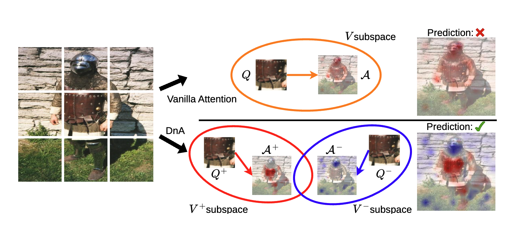

# DNA

<p align="center">
  
</p>

Minimal training repository for the DNA ImageNet model.

## Install

```bash
conda create -n dna python=3.12
conda activate dna
pip install --upgrade pip
pip install -r requirements.txt
```

## Dataset Layout

Point `--data-path` to an ImageNet directory with this structure:

```text
/path/to/imagenet/
├── train/
└── validation/
```

## Train

### Local

```bash
torchrun --nproc_per_node=1 main.py \
  --model dna_base_patch16_224 \
  --batch-size 256 \
  --grad_accum_steps 4 \
  --input-size 224 \
  --data-path /path/to/imagenet \
  --data-set IMNET \
  --no-model-ema \
  --epochs 300 \
  --num_workers 8 \
  --weight-decay 0.075 \
  --drop-path 0.15 \
  --mixup 0.8 \
  --cutmix 1.0 \
  --output_dir ./runs/adeit \
  --run_name dna \
  --wandb_entity <your_entity_name> \
  --wandb_project <your_project_name>
```

### SLURM

The repo includes `scripts/dna.slurm`. Update any cluster-specific options you need, then launch:

```bash
sbatch scripts/dna.slurm
```
